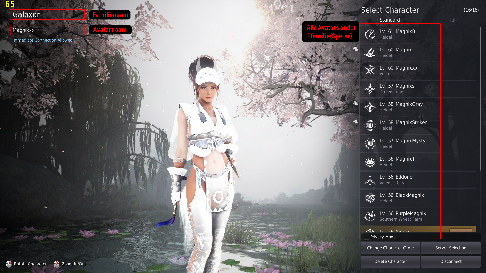
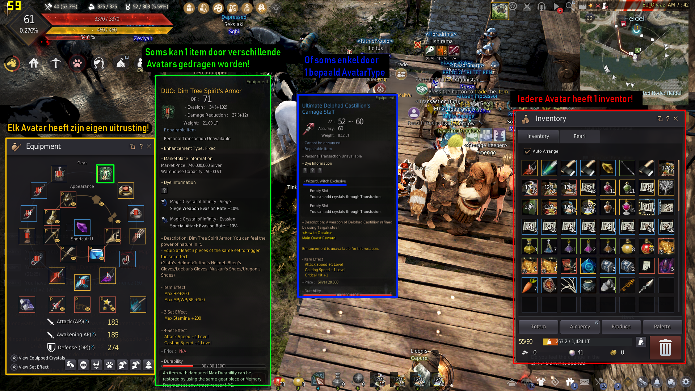
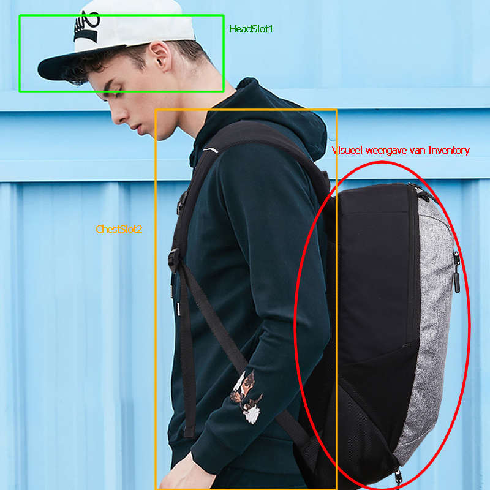
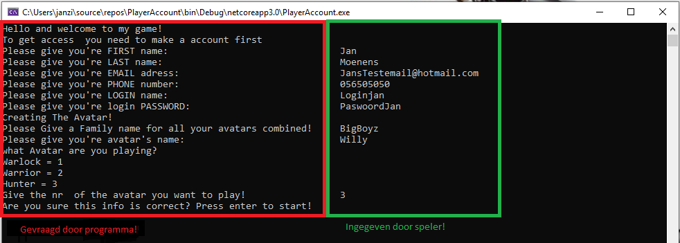
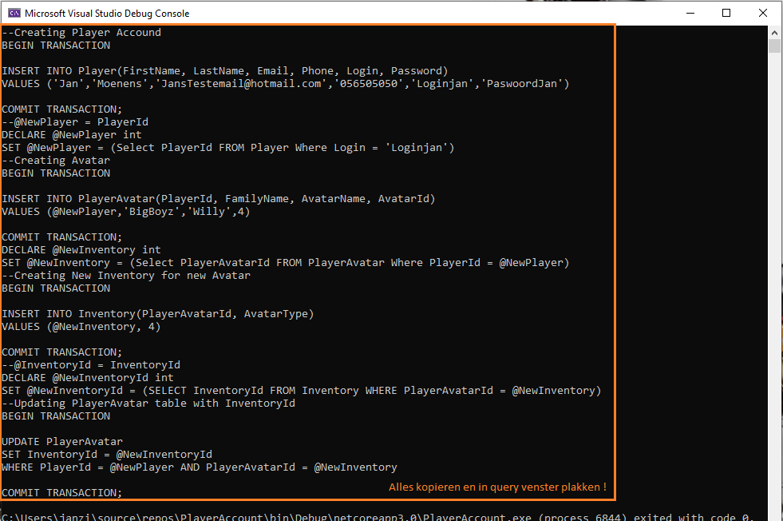

# Eigen Project #

---

Mijn DB kan je vinden op deze pagina onder de map [ExamenDatabase](https://github.com/janmoenens/SQL-/tree/master/EigenDatabaseProject/ExamenDatabase)

Mijn SLN kan je vinden op deze pagina onder de naam [ExamenDatabase.sln](https://github.com/janmoenens/SQL-/blob/master/EigenDatabaseProject/ExamenDatabase.sln)

---

### Uitleg Database!

---

Ik had de bedoeling een database te maken voor een MMORPG! "Massively Multiplayer Online Role Playing Game"
Hierin  moet je dus een account aanmaken met je echte gegevens als je wilt spelen. Waarmee je dan kan inloggen op de game/website waar je kan selecteren met welk avatar je zou willen spelen/aanmaken. Ik probeerde via database duidelijk te maken welke tabellen er nodig zijn en hoe alles gelinkt wordt aan elkaar.
Ik probeerde het ook basic te houden.
Ik heb een tabel voorzien voor de gegevens van een SPELER, een tabel voor de verschillende Avatars, een tabel voor verschillende ITEMS die in de wereld te vinden zijn, en dan ook een tabel om SPELER en AVATAR te linken"PLAYERAVATAR".
Ook werd er een tabel INVENTORY voorzien die dan bijhoud welke AVATAR welke ITEMS in zijn bezit heeft.

Voorbeeld van een Familie en verschillende Avatars onder 1 speler!



Voorbeeld van een Inventory "rood" en voorbeeld van een ChestSlot2 Zoals in mijn DB "groen" Voorbeeld van een MainHand met maar 1 Avatartype "blauw"  En De eigen uitrusting staat voor  alles wat een avater zogezegt zou kunnen dragen "Orange".



---

## Relaties! ##

---

**Many 2 Many**

één speler"PlayerId" kan meerdere avatars hebben : één avatar"AvatarId" kan meerdere spelers hebben.

**One 2 One**

één avatarId kan maar één InventoryId "rugzak" hebben.

**One 2 Many**

één itemId kan in meerdere inventory's"InventoryId" terugkomen : één item kan meedere keren in één InventoryId terugkomen.

---

### User Stories! ###

---

1. 	ALS Speler WIL IK een account aanmaken. ZODAT ik kan inloggen.

2. 	ALS Speler WIL IK een avatar linken aan mijn account ZODAT ik kan spelen.

3.	ALS Speler WIL IK meerdere Avatars aanmaken ZODAT ik kan spelen met andere avatars op de zelfste account.

4.	ALS Speler WIL IK mijn eigen inventory ZODAT ik kan zien welke items er in mijn rugzak zitten.

5.	ALS Speler WIL IK zien welk uitrusting ik kan aandoen ZODAT ik weet wat ik allemaal heb.

6.	ALS Administrator WIL IK Avatars verwijderen ZODAT ik bepaalde mensen kan straffen.

7.	ALS Speler WIL IK mijn eigen stats zien ZODAT ik kan zien waar mijn zwakke punten liggen.

8.	ALS Spelontwikkelaar WIL IK  uitrusting aanmaken ZODAT spelers nieuwe doelen  krijgen. 

9. 	ALS Spelontwikkelaar WIL IK  avatars bijmaken ZODAT spelers blijven spelen.

10.	ALS Spelontwikkelaar WIL IK een event kunnen houden ZODAT ik spelers kunnen belonen met items.

---

### ROLLEN! ###

---

1. Speler
2. Administator
3. Spelontwikkelaar

---

### Visueel Uitleg Inventory! ####

---



Stel u voor dat deze persoon een Avatar is. "bvb een warrior"

Dan kan deze persoon alleen maar items aandoen die van het type onbeslist "NULL" of van het type Warrior zijn. 

Alsook kan een pet bvb enkel aleen voorkomen in een HeadSlot "Deze kenmerk word gegeven in de Tabel Item "SlotTyp".

Voordat deze gedragen kan worden moet die voorkomen in de rugzak "inventory". 

Je kan geen item dragen als je het niet in je bezit zijn.

In je rugzak "inventory kan je verschillende items hebben. "Bvb 5 petten"

Maar je kan er normaal maar 1 op je hoofd zetten "HeadSlot" of je kan er voor kiezen om geen te dragen "NULL".

In je inventory kan je bvb ook iets hebben voor andere avatars. 

Je kan het dan wel in je rugzak hebben maar dan bvb niet aandoen. 

Hier zou je dan mss kunnen ruilen met andere spelers.

Dus in je tabel Inventory kan je verschillende spullen hebben.

En in de kolommen PlayerAvatar/ HEAD-CHEST-BOOTS-MAIN/OFFHAND-Slot kan je Er voor te kiezen NULL = naakt of voor 1 item dat uit je Inventory komt en voor je AvatarType is en in het juist SLOT komt. 

---

## Uitleg Tabellen ###

---

**Tabel Player** 	: Deze tabel houd alle echte gegevens bij van de speler.

PlayerId		: Deze is uniek, alsook de Primary Key voor de tabel. Deze wordt gebruikt in verbinding met PlayerAvatar Tabel.

FirstName 		: Echte Voornaam. NCHAR waarde

LastName		: Echter Achternaam. NCHAR waarde

Email			: Emailaddres waarom eventueel contact kan worden opgenomen met de betrokken persoon. NCHAR waarde

Phone 			: Telefoonnr. INT waarde

Login			: Naam voor de account deze moet uniek zijn zodat er maar 1 persoon kan inloggen. NCHAR, UNIQUE waarde

Password		: Paswoord voor de login NCHAR waarde

---

**Tabel Avatar**	: Deze tabel houd alle verschillende avatars bij alsook hun basis stats.

AvatarId		: Deze is uniek, alsook de Primary key voor de tabel. Deze wordt gebruikt in verbinding met PlayerAvatar Tabel.

Type			: Dit is een naam van een avatar bvb Warlock, Warrior of Hunter in deze db. NCHAR waarde

Health			: Basis waarde Health voor Avatar hangt af welk type avatar. INT DEFAULT waarde

Defence			: Basis waarde Defence voor Avatar hangt af welk type avatar. INT, DEFAULT waarde

Stamina			: Basis waarde Stamina voor Avatar hangt af welk type avatar. INT, DEFAULT waarde

Mana			: Basis waarde Mana voor Avatar hangt af welk type avatar. INT, DEFAULT waarde

---

**Tabel PlayerAvatar** 	: Deze tabel houd de waardes bij van player/avatar alsook alle andere gegevens van gemaakt avatars,
			: van zoals bvb naam, equipment en inventory....
			
PlayerAvatarId 		: Deze is uniek, Alsook de Primary key voor de tabel.

PlayerId		: Link met Player tabel.

AvatarId		: Link met Avatar tabel.

FamilyName		: De groep naam van Avatars. als men meerdere avatars heeft  staat bij elke avatarnaam de zelfste groepnaam.

AvatarName		: Naam van Avatar. Kan maar 1 keer voorkomen. NCHAR , UNIQUE 

InventoryId		: Link met Inventory tabel.

TotalHealth		: INT Healt

TotalDefence		: INT DEFENCE

TotalStamina		: INT Stamina

TotalMana		: INT Mana

HeadSlot1		: INT Wat de avatar draagt op zijn hoofd "zie het als een kledingstuk" NULL of link naar item

ChestSlot2		: INT Wat de avatar draagt op zijn lichaam "zie het als een kledingstuk" NULL of link naar item

BootsSlot3		: INT Wat de avatar draagt op zijn voeten "zie het als een kledingstuk" NULL of link naar item

MainHandSlot4		: INT Wat de avatar draagt in zijn gevechtshand "zie het als iets wat avatar vast heeft om aan te vallen"

OffhandSlot5		: INT Wat de avatar draagt in zijn verdedigingshand "zie het als iets wat de avatar gebruikt om te verdedigen"

---

**Tabel Inventory**	: Deze tabel houd de waardes bij van avatars inventory's. "Zien als rugzak"

InventoryId		: INT Deze is uniek, Alsook de Primary key voor de tabel.

PlayerAvatarId		: INT Deze komt van de tabel PlayerAvatar/PlayerAvatarId Elk item word hierdoor gelinkt aan de juiste Avatar.

AvatarType		: INT Deze houd bij voor welk AvatarType een item is. Kan NULL of voor 1 type Avatar specifiek zijn.

ItemId			: INT Deze word gelinkt aan Tabel Item.

---

**Tabel Item**		: Deze tabel houd de waardes bij van alle bestaande Items in de wereld.

Name			: Nchar Waarde Naam van item.

AvatarType		: Welk Type een item is. Voor alle avatars of specifiek voor 1 type

SlotType		: INT In welk slot het mag komen. NULL bvb geen waarde/ 1 enkel voor HeadSlot1/ 2 enkel voor ChestSlot2 ...

AttackPower		: INT waarde voor aanvalskracht.

DefencePower		: INT waarde voor Defencekracht.

Health			: INT waarde voor Gezondheid.

Stamina			: INT waarde voor Uithoudingsvermogen.

Mana			: INT waarde voor Magische kracht

---

### Alle Constrains. ###

---

**PlayerAvatar**

---

PRIMARY KEY :

	PRIMARY KEY CLUSTERED ([PlayerAvatarId] ASC),

Primare key voor tabel.

FOREIGN KEY :

    	CONSTRAINT [FK_PlayerAvatarId_AvatarId] FOREIGN KEY ([AvatarId]) REFERENCES [dbo].[Avatar] ([AvatarId])

Legt de link van PlayerAvater naar Avatar Via AvatarId.

    	CONSTRAINT [FK_PlayerAvatarId_PlayerId] FOREIGN KEY ([PlayerId]) REFERENCES [dbo].[Player] ([PlayerId])

Legt de link van PlayerAvater naar Player Via PlayerId.

    	CONSTRAINT [FK_PlayerAvatar_Inventory] FOREIGN KEY ([InventoryId]) REFERENCES [dbo].[Inventory] ([InventoryId])

Legt de link van PlayerAvater naar Inventory Via InventoryId.

UNIQUE :

	UNIQUE NONCLUSTERED ([AvatarName] ASC),

AvatarName is uniek. mochten er 2 de zelfste namen bestaan dan zou het moeilijker zijn om uit te zoeken met wie je aan het spelen bent.
mocht je eventueel een chatbericht willen sturen en er bestaan bvb 2 Jan's in het spel  hoe zou het spel dan weten naar wie hij een bericht moet sturen.

**Player**

PRIMARY KEY :

	PRIMARY KEY CLUSTERED ([PlayerId] ASC),

Primare key voor tabel.

UNIQUE :

	UNIQUE NONCLUSTERED ([Login] ASC)

Login is uniek De reden hiervoor is als de login niet uniek zou zijn zou je bvb 2 verschillende paswoorden kunnen hebben op 1 dezelfde naam.
En dan is dit weer onmogelijk om te weten wie er probeert in te loggen.

**Inventory**

PRIMARY KEY :

	PRIMARY KEY CLUSTERED ([InventoryId] ASC),

Primare key voor tabel.

FOREIGN KEY :

	CONSTRAINT [FK_Item_ToInventory] FOREIGN KEY ([ItemId]) REFERENCES [dbo].[Item] ([ItemId])

Legt de link van Inventory naar Item via ItemId.

**Item**

PRIMARY KEY :

	PRIMARY KEY CLUSTERED ([ItemId] ASC),

Primare key voor tabel.

UNIUQE :
 	
	UNIQUE NONCLUSTERED ([Name] ASC)

Name  is hier uniek omdat er geen 2 items met de zelfste naam kunnen zijn. zou alleen maar voor verwarring zorgen.

---

### Onnodig maar handig geweest! ###

Ik had voor mezelf een programma geschreven in een console applicatie die aan mij de input vroeg om nieuwe gebruikers toe te voegen aan mijn database. 



Omdat ik het beter vondt telkens alle info die nodig was te typen zonder te moeten zoeken waar ik input moest veranderen in mijn query.

kreeg in dan nadat ik alles had ingevuld een compleet query die ik dan gewoon kan knippen en plakken in een nieuwe query. 




Natuurlijk zou het nog beter zijn om rechtstreeks mijn database te kunnen uitlezen. maar dit hebben we nog niet gezien in de les. dus moet je zelf voor ORM spelen 

[![ORM Youtube Video])]()(https://www.youtube.com/watch?v=dHQ-I7kr_SY)

Object-Relational Mapping (ORM) is a technique that lets you query and manipulate data from a database using an object-oriented paradigm. When talking about ORM, most people are referring to a library that implements the Object-Relational Mapping technique, hence the phrase "an ORM".

An ORM library is a completely ordinary library written in your language of choice that encapsulates the code needed to manipulate the data, so you don't use SQL anymore; you interact directly with an object in the same language you're using.


---

### UserScrips die te maken hebben met userstory's Zie Hieronder ###

---

**USERSTORY 1 en 2** 

---
```SQL
--1 en 2 samengenomen omdat als met een account aanmaakt men normaal ook wel een Avatar wil aanmaken
--Creating Player Accound

BEGIN TRANSACTION

INSERT INTO Player (
	FirstName
	,LastName
	,Email
	,Phone
	,LOGIN
	,Password
	)
VALUES (
	'jan'
	,'moenens'
	,'janmoenens@test.be'
	,'454545'
	,'jan10'
	,'Admin'
	)

COMMIT TRANSACTION;

--@NewPlayer = PlayerId
DECLARE @NewPlayer INT

SET @NewPlayer = (
		SELECT PlayerId
		FROM Player
		WHERE LOGIN = 'jan10'
		)

--Creating Avatar
BEGIN TRANSACTION

INSERT INTO PlayerAvatar (
	PlayerId
	,FamilyName
	,AvatarName
	,AvatarId
	)
VALUES (
	@NewPlayer
	,'Familie10'
	,'TienOmTeZien'
	,2
	)

COMMIT TRANSACTION;

DECLARE @NewInventory INT

SET @NewInventory = (
		SELECT PlayerAvatarId
		FROM PlayerAvatar
		WHERE PlayerId = @NewPlayer
		)

--Creating New Inventory for new Avatar
BEGIN TRANSACTION

INSERT INTO Inventory (
	PlayerAvatarId
	,AvatarType
	)
VALUES (
	@NewInventory
	,2
	)

COMMIT TRANSACTION;

--@InventoryId = InventoryId
DECLARE @NewInventoryId INT

SET @NewInventoryId = (
		SELECT InventoryId
		FROM Inventory
		WHERE PlayerAvatarId = @NewInventory
		)

--Updating PlayerAvatar table with InventoryId
BEGIN TRANSACTION

UPDATE PlayerAvatar
SET InventoryId = @NewInventoryId
WHERE PlayerId = @NewPlayer
	AND PlayerAvatarId = @NewInventory

COMMIT TRANSACTION;
```
---

**USERSTORY 3**

---
```SQL
--Creer nieuw avatar voor bestaande accound
BEGIN TRANSACTION

--Voor wie wordt de nieuwe  avatar gemaakt?
DECLARE @LoginNaam NCHAR(20)

SET @LoginNaam = 'jan10' -- dit aanpassen

DECLARE @NewAvatar INT

SET @NewAvatar = (
		SELECT PlayerId
		FROM Player
		WHERE LOGIN = @LoginNaam
		)

--Creer nieuwe Avatar voor bestaande Familie 
DECLARE @FamilynaamAccound NCHAR(50)

SET @FamilynaamAccound = (
		SELECT FamilyName
		FROM PlayerAvatar
		WHERE PlayerId = @NewAvatar
		)

--Nieuw Type Avatar... WARLOCK 1 / WARRIOR 2 / HUNTER 4
DECLARE @AvatarType INT

SET @AvatarType = 2 -- dit aanpassen

DECLARE @NewAvatarName NCHAR(20)

SET @NewAvatarName = 'NAAMAvatarVeranderen' -- dit aanpassen

--Invoegen gegevens  nieuw Avatar
INSERT INTO PlayerAvatar (
	PlayerId
	,FamilyName
	,AvatarName
	,AvatarId
	,TotalHealth
	,TotalDefence
	,TotalStamina
	,TotalMana
	)
VALUES (
	@NewAvatar
	,@FamilynaamAccound
	,@NewAvatarName
	,@AvatarType
	,100
	,100
	,100
	,100
	)

--Zoek welke  avatar een inventory moet krijgen
DECLARE @NewInventoryVoor INT

SET @NewInventoryVoor = (
		SELECT PlayerAvatarId
		FROM PlayerAvatar
		WHERE AvatarName = @NewAvatarName
		)

--creer nieuwe inventory voor nieuwe avatar
INSERT INTO Inventory (
	PlayerAvatarId
	,AvatarType
	)
VALUES (
	@NewInventoryVoor
	,@AvatarType
	)

--Zoeken welke InventoryId is voor de nieuwe avatar
DECLARE @NewInventoryId INT

SET @NewInventoryId = (
		SELECT InventoryId
		FROM Inventory
		WHERE PlayerAvatarId = @NewInventoryVoor
		)

--Updating PlayerAvatar table with InventoryId
UPDATE PlayerAvatar
SET InventoryId = @NewInventoryId
WHERE PlayerId = @NewAvatar
	AND PlayerAvatarId = @NewInventoryVoor

COMMIT TRANSACTION;
```
---

**USERSTORY 4**

---
```SQL
--Geef alles weer wat een avatar in zijn inventory heeft.
DECLARE @Player NCHAR(20)

SET @Player = 'Jedi'

SELECT pa.AvatarName AS [Avatar Naam]
	,pa.FamilyName AS [Avatar Familie Naam]
	,pa.PlayerAvatarId AS [Id Avatar]
	,pa.PlayerId AS [Id Speler]
	,pa.InventoryId AS [Id Inventory Speler]
	,i.AvatarType AS [Type Avatar]
	,i.ItemId AS [Id Item]
	,it.Name AS [Naam Item]
	,it.AvatarType AS [Item Type Avatar]
FROM PlayerAvatar AS pa
LEFT JOIN Inventory AS i ON pa.PlayerAvatarId = i.PlayerAvatarId
LEFT JOIN Item AS it ON i.ItemId = it.ItemId
WHERE pa.AvatarName = @Player
```
---

**USERSTORY 5**

---
```SQL
--Geef enkel weer wat een avatar kan aandoen en in zijn inventory zitten heeft
DECLARE @Player NCHAR(20)

SET @Player = 'Jedi'

SELECT pa.AvatarName AS [Avatar Naam]
	,pa.FamilyName AS [Avatar Familie Naam]
	,pa.PlayerAvatarId AS [Id Avatar]
	,pa.PlayerId AS [Id Speler]
	,pa.InventoryId AS [Id Inventory Speler]
	,i.AvatarType AS [Type Avatar]
	,i.ItemId AS [Id Item]
	,it.Name AS [Naam Item]
	,it.AvatarType AS [Item Type Avatar]
	,it.SlotType AS [Kan Enkel In Slot]
FROM PlayerAvatar AS pa
LEFT JOIN Inventory AS i ON pa.PlayerAvatarId = i.PlayerAvatarId
LEFT JOIN Item AS it ON i.ItemId = it.ItemId
WHERE it.AvatarType = pa.AvatarId
	OR it.AvatarType IS NULL
	AND pa.AvatarName = @Player
	AND it.ItemId IS NOT NULL
```
---

**USERSTORY 6**

---
```SQL
--Verwijder alles van 1 bepaalde avatar.
BEGIN TRANSACTION

DECLARE @DeleteAvatar INT

SET @DeleteAvatar = (
		SELECT PlayerAvatarId
		FROM PlayerAvatar
		WHERE AvatarName = 'Test2'
		)

DELETE
FROM PlayerAvatar
WHERE PlayerAvatarId = @DeleteAvatar;

COMMIT TRANSACTION
```
---

**USERSTORY 7**

---
```SQL
--Optellen van stats  Player + Avatar + Gearslots 
SELECT pa.TotalHealth + a.Health + i1.Health + i2.Health + i3.Health + i4.Health + i5.Health AS [Total Health]
	,pa.TotalDefence + a.Defence + i1.Defence + i2.Defence + i3.Defence + i4.Defence + i5.Defence AS [Total Defence]
	,pa.TotalStamina + a.Stamina + i1.Stamina + i2.Stamina + i3.Stamina + i4.Stamina + i5.Stamina AS [Total Stamina]
	,pa.TotalMana + a.Mana + i1.Mana + i2.Mana + i3.Mana + i4.Mana + i5.Mana AS [Total Mana]
FROM PlayerAvatar AS pa
INNER JOIN Avatar AS a ON pa.AvatarId = a.AvatarId
INNER JOIN Item AS i1 ON pa.HeadSlot1 = i1.ItemId
INNER JOIN Item AS i2 ON pa.ChestSlot2 = i2.ItemId
INNER JOIN Item AS i3 ON pa.BootsSlot3 = i3.ItemId
INNER JOIN Item AS i4 ON pa.MainHandSlot4 = i4.ItemId
INNER JOIN Item AS i5 ON pa.OffHandSlot5 = i5.ItemId
WHERE AvatarName = 'Jedi3'

SELECT pa.TotalHealth + a.Health + i1.Health + i2.Health + i3.Health + i4.Health + i5.Health AS [Total Health]
	,pa.TotalDefence + a.Defence + i1.Defence + i2.Defence + i3.Defence + i4.Defence + i5.Defence AS [Total Defence]
	,pa.TotalStamina + a.Stamina + i1.Stamina + i2.Stamina + i3.Stamina + i4.Stamina + i5.Stamina AS [Total Stamina]
	,pa.TotalMana + a.Mana + i1.Mana + i2.Mana + i3.Mana + i4.Mana + i5.Mana AS [Total Mana]
FROM PlayerAvatar AS pa
INNER JOIN Avatar AS a ON pa.AvatarId = a.AvatarId
INNER JOIN Item AS i1 ON pa.HeadSlot1 = i1.ItemId
INNER JOIN Item AS i2 ON pa.ChestSlot2 = i2.ItemId
INNER JOIN Item AS i3 ON pa.BootsSlot3 = i3.ItemId
INNER JOIN Item AS i4 ON pa.MainHandSlot4 = i4.ItemId
INNER JOIN Item AS i5 ON pa.OffHandSlot5 = i5.ItemId
WHERE AvatarName = 'Jedi2'

SELECT pa.TotalHealth + a.Health + i1.Health + i2.Health + i3.Health + i4.Health + i5.Health AS [Total Health]
	,pa.TotalDefence + a.Defence + i1.Defence + i2.Defence + i3.Defence + i4.Defence + i5.Defence AS [Total Defence]
	,pa.TotalStamina + a.Stamina + i1.Stamina + i2.Stamina + i3.Stamina + i4.Stamina + i5.Stamina AS [Total Stamina]
	,pa.TotalMana + a.Mana + i1.Mana + i2.Mana + i3.Mana + i4.Mana + i5.Mana AS [Total Mana]
FROM PlayerAvatar AS pa
INNER JOIN Avatar AS a ON pa.AvatarId = a.AvatarId
INNER JOIN Item AS i1 ON pa.HeadSlot1 = i1.ItemId
INNER JOIN Item AS i2 ON pa.ChestSlot2 = i2.ItemId
INNER JOIN Item AS i3 ON pa.BootsSlot3 = i3.ItemId
INNER JOIN Item AS i4 ON pa.MainHandSlot4 = i4.ItemId
INNER JOIN Item AS i5 ON pa.OffHandSlot5 = i5.ItemId
WHERE AvatarName = 'Jedi'
```
---

**USERSTORY 8**

---
```SQL
BEGIN TRANSACTION

--Naam Item
DECLARE @naam NCHAR(50)

SET @naam = ('Kerstmantel') -- altijd een nieuwe naam geven

--Type Avatar
DECLARE @type NCHAR(5)

SET @type = NULL -- 1 = warlock / 2 = warrior / 4 = hunter / NULL = alle chars

--Voor Welk EquipmentSlot Is Het
DECLARE @SlotType INT

SET @SlotType = 2 -- 1 = helm / 2 = chest / 3 = boots / 4 = mainhand / 5 = offhand

DECLARE @Attack INT

SET @Attack = 0 --indien geen waarde altijd 0 zetten

DECLARE @Defence INT

SET @Defence = 0 --indien geen waarde altijd 0 zetten

DECLARE @Health INT

SET @Health = 0 --indien geen waarde altijd 0 zetten

DECLARE @Stamina INT

SET @Stamina = 0 --indien geen waarde altijd 0 zetten

DECLARE @Mana INT

SET @Mana = 0 --indien geen waarde altijd 0 zetten

INSERT INTO Item (
	Name
	,AvatarType
	,SlotType
	,AttackPower
	,Defence
	,Health
	,Stamina
	,Mana
	)
VALUES (
	@naam
	,@type
	,@SlotType
	,@Attack
	,@Defence
	,@Health
	,@Stamina
	,@Mana
	)

COMMIT TRANSACTION
```
---

**USERSTORY 9**

---
```SQL
--Creating New Avatar
BEGIN TRANSACTION

INSERT INTO Avatar (
	Type
	,Health
	,Defence
	,Stamina
	,Mana
	)
VALUES (
	'TestAvatar'
	,100
	,100
	,100
	,100
	)

ROLLBACK TRANSACTION
```
---

**USERSTORY 10**

---
```SQL
--Geef iedereen in de server een EventItem
INSERT INTO Inventory (
	PlayerAvatarId
	,AvatarType
	,ItemId
	)
SELECT DISTINCT (PlayerAvatarId)
	,1
	,25
FROM Inventory
```
---
